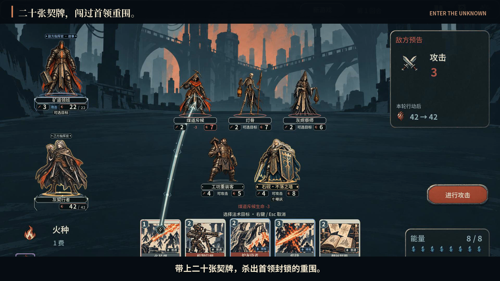
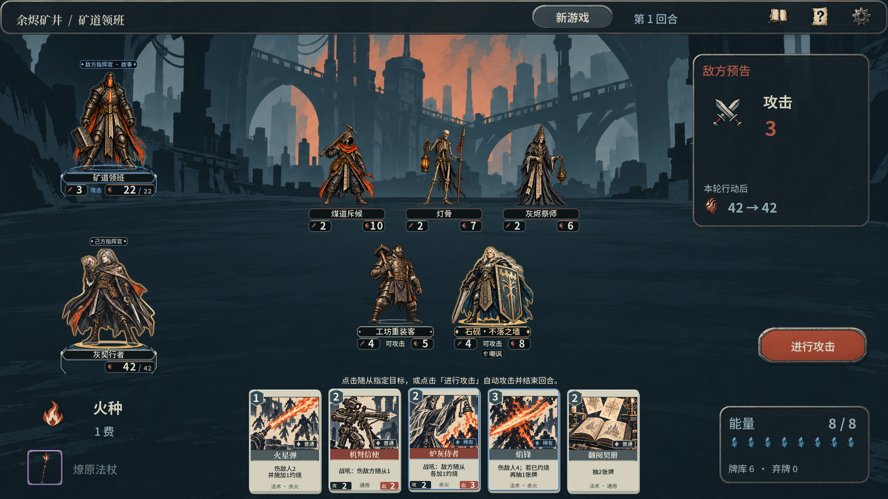
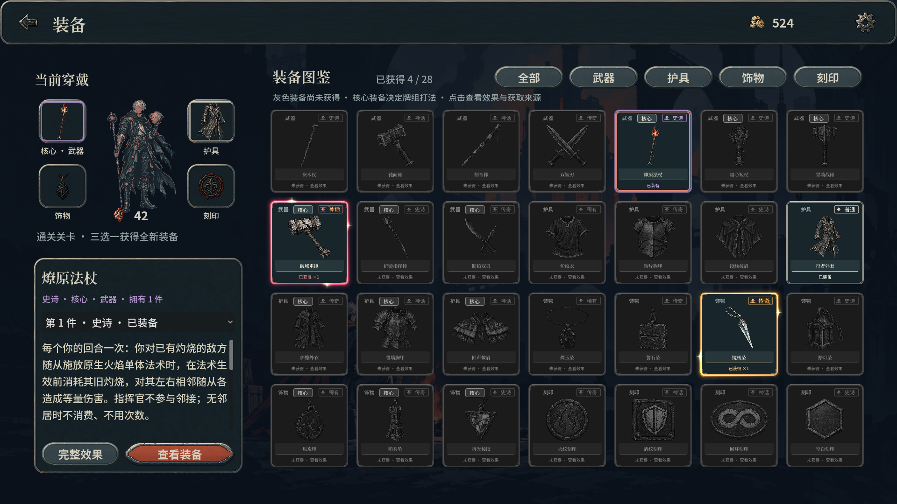

# 灰契行者

**灰烬之中，重铸你的牌局。**

**[观看 34 秒中文叙事预告 →](https://scott1743.github.io/huiqi-walker-promo/#trailers)** · [直接打开预告 MP4](assets/videos/narrative.zh-CN.mp4)

矿井的炉火，烧不尽你的野心。带着二十张契牌挑战首领，夺下战利品，再向更深处出发。主预告、战斗篇、构筑篇分别采用独立脚本与全新中文配音。

《灰契行者》是一款单人装备构筑卡牌 RPG。深入余烬矿井、镜域工坊与封存档案，搜集会改变打法的装备：将旧灼烧化为邻接伤害，以护甲换取英雄出手，让符合条件的法术留下回声。保留手牌，布置随从，再携已经获得的永久战利品返回工坊，准备新的构筑。

**[进入完整宣传页 →](https://scott1743.github.io/huiqi-walker-promo/)** · [观看预告与实机展示](https://scott1743.github.io/huiqi-walker-promo/#trailers)

## 同一手契牌，另一种解法

- **装备改变战术。** 围绕核心武器安排目标、位置、出牌顺序与资源使用，让熟悉的契牌组成新的配合。
- **留住手牌，掌握时机。** 20 张牌组、五个己方随从位置；普通手牌跨回合保留，临时回声在回合结束时消散。
- **远征结束，收获留下。** 战败或主动撤回后，已经收入行囊的装备与资源仍然保留。回到营地换装、改牌、用金币开启卡包，再次出发。
- **破解三章首领。** 拆除炉膛、击碎镜面、打断目录页，在故事、精锐与大师难度中验证构筑；难度随进度开放。
- **逐步扩展收藏。** 48 张可收藏契牌、6 种衍生牌、12 件核心装备与十套可编辑构筑参考；金币购买卡包，开启才获得新牌，重复卡自动返金。

## 看一场牌局，也看下一套构筑

| 战斗与机关 | 工坊与成长 |
| --- | --- |
|  |  |
| [战斗篇 · 27 秒](https://scott1743.github.io/huiqi-walker-promo/#trailers)：召唤、法术指向、随从攻击与首领机关。 | [构筑成长篇 · 30 秒](https://scott1743.github.io/huiqi-walker-promo/#trailers)：通关三选一、金币开包、换牌、换装与路线选择。 |

[浏览全部实机截图](assets/screenshots/) · [在宣传页中播放视频、查看图集](https://scott1743.github.io/huiqi-walker-promo/)

MP4 文件：[中文叙事预告 · 34 秒](assets/videos/narrative.zh-CN.mp4) · [战斗篇](assets/videos/combat.zh-CN.mp4) · [构筑成长篇](assets/videos/builds.zh-CN.mp4)

三支宣发视频分别采用独立台词与中文旁白，配合原创音乐、快慢剪辑和稳定构图。实机视频与页面展示的 14 张截图来自游戏 **1.2.1** 的真实运行画面，使用隔离的展示进度录制。更多来源与字体许可见 [媒体说明](MEDIA.md)。

## 关注后续更新

喜欢这种围绕战利品重组牌局的冒险，可以在 [GitHub 仓库](https://github.com/Scott1743/huiqi-walker-promo) 点击 **Star**，或使用 **Watch** 关注宣传材料更新。版本记录见 [Releases](https://github.com/Scott1743/huiqi-walker-promo/releases) 与 [更新日志](CHANGELOG.md)。

## 当前版本

| 内容 | 版本 |
| --- | --- |
| 宣传页 | **1.1.3**（2026-10-11） |
| 本次展示的游戏 | **1.2.1** |

宣传页版本用于记录网页、文案与媒体的更新；游戏版本用于标明画面对应的游戏内容。本仓库提供宣传页和媒体资料。版本数据见 [version.json](version.json)。
